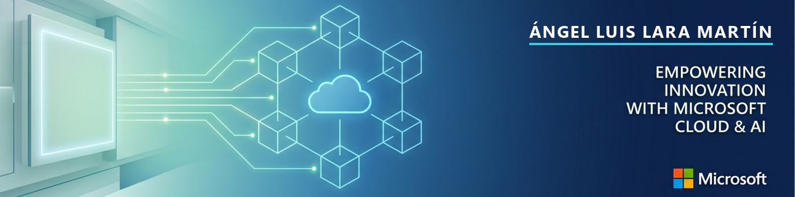

<a href="README.md">English</a> · <b>Español</b>

  

  
  
  
  

  
  

---

### Sobre mí

Ingeniero Informático especializado en Cloud e IA. Construyo arquitecturas cloud en Azure y AWS, agentes de IA y sistemas RAG, y aplicaciones full stack. Enfocado en entregar valor medible. Proactivo, curioso y con gran capacidad de aprendizaje.

- Actualmente: Cloud &amp; AI Specialist Intern @ Microsoft
- Grado en Ingeniería Informática (Sistemas de la Información), Universidad de Castilla-La Mancha
- Certificaciones: AZ-900, DP-900, AI-900
- Idiomas: Español (nativo), Inglés (C1)

### Certificaciones

### Proyectos destacados

| Proyecto | Descripción |
| :-- | :-- |
| **[Entangle](https://github.com/aangell98) ·** *Trabajo Fin de Grado* | Agente de IA config-driven (6 workers) con RAG que mapea y analiza el ecosistema open source de computación cuántica en GitHub. 96,7% de acierto de enrutado, 1.087 tests. |
| **[insurance-ai-agents](https://github.com/aangell98/insurance-ai-agents)** | Procesamiento multiagente de siniestros de seguros. Gobernado, seguro y auditable. Azure OpenAI. |
| **[sales-cockpit-ai-agents](https://github.com/aangell98/sales-cockpit-ai-agents)** | Cockpit comercial agéntico white-label + un Copilot en Microsoft Teams para banqueros. |
| **[policyforge](https://github.com/aangell98/policyforge)** | Fábrica de políticas y cumplimiento con IA: convierte el cambio normativo en un diff explicable y auditable. |

### Ahora mismo

- Diseñando soluciones cloud e IA escalables en Microsoft
- Construyendo mi web de **[portfolio](https://github.com/aangell98/portfolio)**
- Explorando IA agéntica, RAG y el Microsoft Agent Framework

### Tecnologías

### Contacto

<i>Portfolio en vivo &middot; aangell98.github.io/portfolio</i>

